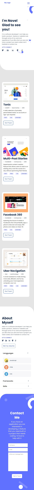

# Project: Portfolio

> This project is a task to build personal portfolio, to parse a Figma design, use Flexbox and CSS Grid to place elements in the page.  It covers html and css and applying linters on each of them.



New additions:

* Using pair programming: evaluate, report and correct the accessibility for page titles, image text alternatives, text headings, color contrast, resize, interaction, moving content, multimedia and the basic structure of the page

## Built With

- Html + Css

## Live Demo Of The Project

https://nj-2020.github.io/My-Portfolio-Web-Designs/

### Usage

This is used for learning purposes. Feel free to collaborate.

### Run tests

To locally run tests using html and css linters.

Use:

For HTML:
```
npx hint .
```

For CSS:
```
npx stylelint "**/*.{css,scss}" 
```
### Deployment

Make a pull request if you want to contribute. Thanks.

## Authors

👤 **NJ-2020**

- GitHub: [NJ](https://github.com/NJ-2020)

👤 **AkashaRojee**

- GitHub: [AkashaRojee](https://github.com/AkashaRojee)

## 🤝 Contributing

Contributions, issues, and feature requests are welcome!

## Show your support

Please. Give a ⭐️ if you like this project!
